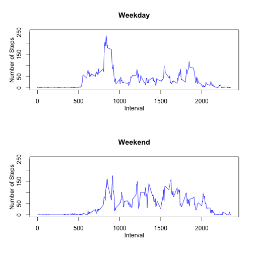

# Reproducible Research: Peer Assessment 1

This is a short report describing the data analysis performed on the activity data provided for Peer Assignment 1 in Reproducible Research.

## Loading and preprocessing the data
Before running some of the later commands, it will be necessary to install and include the plyr package

```r
library("plyr")
```

Actually loading the data is simple, the following will load the file (note that activity.csv will have to be in the same directory as as the script):

```r
activity_monitor_data <- read.csv("activity.csv", header = TRUE, sep = ",")
```


## What is mean total number of steps taken per day?
I first use the plyr package to calculate the total number of steps taken per day and then the mean and median of those steps for each day and then calculated the histogram of the total number of steps per day


```r
total_steps_per_day <- ddply(activity_monitor_data, .(date), summarize, total = sum(steps))

mean_daily_steps <- mean(total_steps_per_day$total, na.rm = TRUE)
median_daily_steps <- median(total_steps_per_day$total, na.rm = TRUE)

hist(total_steps_per_day$total, xlab = "Total Steps", ylab = "Frequency", main = "Total Number Of Steps per Day")
```

 


So we can see from this that the mean number of steps is 10766 and the median is 10765

## What is the average daily activity pattern?
The average number of steps for each interval across all days is:


```r
average_steps_per_interval <- ddply(activity_monitor_data, .(interval), summarize, 
    average = mean(steps, na.rm = TRUE))
plot(average_steps_per_interval, type = "l", main = "Average Steps By Interval", 
    xlab = "Interval", ylab = "Average")
```

 


## Imputing missing values
In order to properly impute the missing values, I first investigated the patterns of missing data.  Let's first look at how many values of each column are missing using the following code:


```r
number_of_missing_dates <- length(which(is.na(activity_monitor_data$date)))
number_of_missing_intervals <- length(which(is.na(activity_monitor_data$interval)))
number_of_missing_steps <- length(which(is.na(activity_monitor_data$steps)))
```


This reveals that there are 0 missing dates, 0 missing intervals and 2304 missing steps. Therefore, we are only worried about imputing steps since that is the only column with missing values.  

Next, I graphed the missing values by interval:


```r
null_steps = which(is.na(activity_monitor_data$steps))
hist(as.numeric(activity_monitor_data$interval[null_steps]), main = "Total Missing Intervals", 
    xlab = "Interval")
```

 


This shows that data is missing pretty uniformly across intervals on average.  Next let's see if certain days of the week are missing more than others.  First we will assign a new column with the names of the days of the week and then create a table of the count of missing values for that day.  Since the data encompasses several months, the number of intervals in each day of the week should be roughly equal so this should be valid:


```r
activity_monitor_data$day_name <- weekdays(as.Date(activity_monitor_data$date))
table(activity_monitor_data$day_name, is.na(activity_monitor_data$steps))
```

```
##            
##             FALSE TRUE
##   Friday     2016  576
##   Monday     2016  576
##   Saturday   2016  288
##   Sunday     2016  288
##   Thursday   2304  288
##   Tuesday    2592    0
##   Wednesday  2304  288
```


Interestingly, we are missing more values for Friday and Monday and much less for Tuesday. Because of this relationship between day of the week and missing data, I wanted to incorporate the week day into the imputation technique.  However, I worried that basing the model off day and interval would not give enough data points to properly impute the missing values since there are only about 8 of each day of the week in the dataset. Therefore, I decided to impute based on the day being a weekend or not and interval.  To do this I first assigned a new column with the weekend status of the record (1 if record originated on a Saturday or Sunday, 0 otherwise) and then calculated a mean by interval for each status.  This was done with the following code:


```r
activity_monitor_data$is_week_end <- 0
activity_monitor_data$is_week_end[which(activity_monitor_data$day_name == "Saturday")] <- 1
activity_monitor_data$is_week_end[which(activity_monitor_data$day_name == "Sunday")] <- 1

mean_steps_by_interval_and_weekend <- ddply(activity_monitor_data, .(interval, 
    is_week_end), summarize, mean = mean(steps, na.rm = TRUE))

activity_monitor_data_imputed <- activity_monitor_data
activity_monitor_data_imputed$steps <- apply(activity_monitor_data_imputed, 
    1, function(x) {
        if (!is.na(x[1])) 
            return(as.numeric(x[1]))
        return(mean_steps_by_interval_and_weekend$mean[which(as.numeric(mean_steps_by_interval_and_weekend$is_week_end) == 
            as.numeric(x[5]) & as.numeric(mean_steps_by_interval_and_weekend$interval) == 
            as.numeric(x[3]))][1])
    })
```


We can see that the imputation had little impact on the overall data by creating a histogram of the imputed data, similar to what was constructed earlier:


```r
total_steps_per_day_imputed <- ddply(activity_monitor_data_imputed, .(date), 
    summarize, total = sum(steps))
hist(as.numeric(total_steps_per_day_imputed$total), main = "Histogram of Total Steps Per Day in Imputed Data", 
    xlab = "Total steps")
```

 

```r

mean_daily_steps_imputed <- mean(total_steps_per_day_imputed$total, na.rm = TRUE)
median_daily_steps_imputed <- median(total_steps_per_day_imputed$total, na.rm = TRUE)
```


The mean daily steps in the imputed data is 10762 and the median is 10571. These are very similar to the original dataset, as is expected since we imputed the values based on mean. The histogram shows that the data stayed the same except for extra data being added to the center, which is also expected based on my imputation technique.  

## Are there differences in activity patterns between weekdays and weekends?

Now that we have the imputed datasets, let's generate the mean steps for each interval for the weekends and weekdays and then graph them to see if there are significant difference:


```r
weekday_intervals <- which(activity_monitor_data_imputed$is_week_end == 0)
weekend_intervals <- which(activity_monitor_data_imputed$is_week_end == 1)

mean_steps_by_imputed_weekday <- ddply(activity_monitor_data[weekday_intervals, 
    ], .(interval), summarize, mean = mean(steps, na.rm = TRUE))
mean_steps_by_imputed_weekend <- ddply(activity_monitor_data[weekend_intervals, 
    ], .(interval), summarize, mean = mean(steps, na.rm = TRUE))

par(mfcol = c(2, 1))

line_col <- "blue"
yLim <- c(0, 250)
yLabel <- "Number of Steps"
xLabel <- "Interval"

plot(mean_steps_by_imputed_weekday$interval, mean_steps_by_imputed_weekday$mean, 
    type = "l", col = line_col, ylim = yLim, ylab = "", xlab = "", main = "Weekday")
mtext(xLabel, side = 1, line = 2)
mtext(yLabel, side = 2, line = 2)
plot(mean_steps_by_imputed_weekend$interval, mean_steps_by_imputed_weekend$mean, 
    type = "l", col = line_col, ylim = yLim, ylab = "", xlab = "", main = "Weekend")
mtext(xLabel, side = 1, line = 2)
mtext(yLabel, side = 2, line = 2)
```

 


These graphs show a strong difference between the weekend and weekday.  These differences make sense for each type of data.  For example, according to the graphs, people tend to be more active during the weekend overall, but are on average more active in the early morning during the week.

This report contained an overview of the data analysis performed as part of Peer Assignment 1.  Initially, data was loaded and then the daily patterns were analyzed to uncover the best imputation method.  That method was applied and then the usage pattern between weekdays and weekends was compared.
